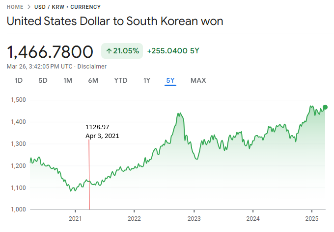
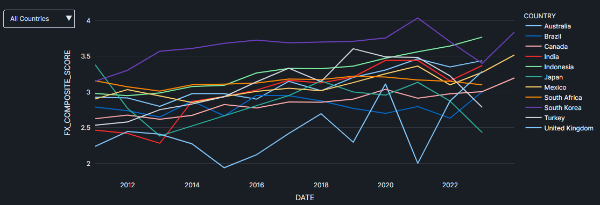
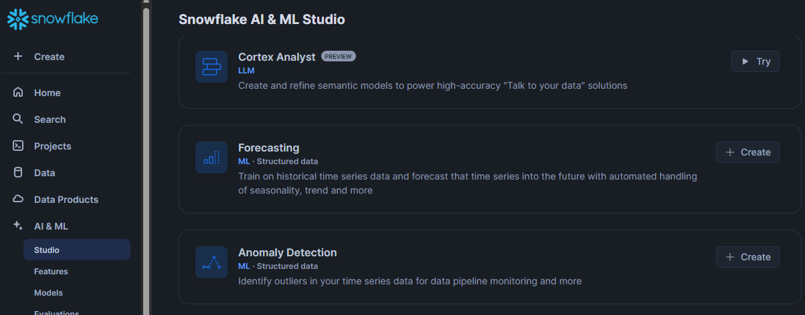

# Snowflake FX Analysis

This repo contains the follow-up to my 2021 submission to the Snowflake Data Marketplace Competition.

- [Snowflake FX Analysis](#snowflake-fx-analysis)
  - [Competition Prompt](#competition-prompt)
  - [Original Submission](#original-submission)
  - [Updated Analysis](#updated-analysis)
  - [Fundamental Analysis](#fundamental-analysis)
  - [New Recommendation](#new-recommendation)
  - [ML Forecast](#ml-forecast)
    - [Forecasted ROI for Selected Currencies](#forecasted-roi-for-selected-currencies)
  - [Conclusion](#conclusion)

## Competition Prompt

A U.S. client wants to investment $1m in a foreign currency. The investment would be made in UDS and need to be locked for a period of one year.

Provide an analysis and recommendation on which foreign currency the client should invest.

## Original Submission

My original recommendation was to invest in KRW (South Korean Won). Had the client invested in KRW in April 3rd of 2021, the ROI would have been **23%** today.

*ref: Google Finance*

## Updated Analysis

I wanted to take a second pass at this project for the following reasons:

1. To make improvements to my initial analysis process.
2. Add a forecast using Snowflake's ML capabilities.
3. Refamiliarize myself with Snowflake.

## Fundamental Analysis

In my first submission I analyzed macroecnomic data publicly available on Snowflake's Data Marketplace. I was unable to find the original data set but Snowflake had public financial data available. 

My original approach looked `GDP growth`, `interest rates` and `CPI`.

For my revised analysis I used the indicators:

1. `debt to gdp ratio`
2. `gdp growth YoY`
3. `real interest rates` (central bank policy rates - cpi)
4. `trade balance`
5. `currency reserves`

Additionally, I created a normalized composite FX score to attempt to capture the information in the above indicators as one metric.

Unfortunately due to the limited amount of data, only a few countries were able to have complete scores and even those rarely had the most current data.

However, the South Korean Won still had the highest score available. This helped confirm that my composite score was at least able to confirm my initial conclusion.

## New Recommendation

From the fundamental analysis, I would recommend the client move some money into the **Great Britain Pound (GBP)**. This is because the FX composite score for the UK is seeing high upward momentum.

## ML Forecast

To further improve on my original submission and to test out Snowflake's ML capabilities, I used the ML Studio to quicly create a time series forecasting model.

I found this process to be very smooth and I have always enjoyed being able to build ML models with just SQL as I find it is easier to maintain and explain to business stakeholders.

I looked at a few assets and found the GBP had the highest ROI when prices were forecast out 1 year.* **

### Forecasted ROI for Selected Currencies

| Asset | ROI    |
|-------|--------|
| GBP   | 6.78%  |
| CAD   | 0.01%  |
| INR   | 5.13%  |
| JPY   | 2.38%  |

**Note: I wanted to forecast KRW as well, but encountered an issue where the predicted values were all identical.*

** *Note: I only forecast the four countries listed even though there were countries with higher scores. In a real world setting I would forecast all the countries that had fx composite scores within the top 10% of scores.**

## Conclusion

I enjoyed going through this problem again. I am not a finance professional and only have a hobbyist's understanding of macroeconomic and investment analysis so please forgive any misunderstandings I may have made with my analysis. I did this for fun and I have no plans of making any FX investments.

Snowflake has improved a lot over the last few years and I was impressed my the out-of-the-box ML capabilities that were not available when I participated in the competition. Additionally, the data marketplace is still top-notch and made getting access to the data I needed (often one of the worst parts of being a data professional) a breeze.

The updated UI in Snowflake was very user friendly due to it's simplicity. I typically work with Databricks professionally, and it's UI is often more cumbersome due to how many menus and tools you have access to.

**None of the information I have stated or provided is financial advice.**
